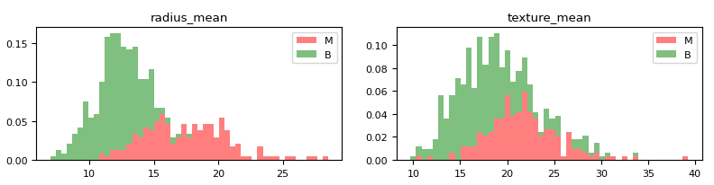
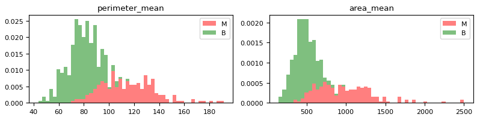
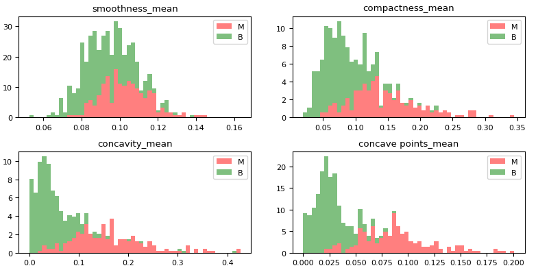
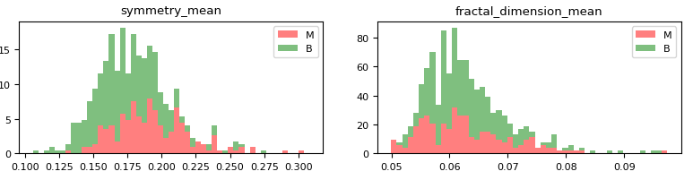

# Breast Cancer Prediction Project

This project involves training multiple machine learning models to predict breast cancer diagnosis based on various features. The models considered are Logistic Regression, Decision Tree, and Random Forest. The dataset used contains ten real-valued features computed for each cell nucleus, along with the diagnosis label (M = malignant, B = benign).

## Dataset

The dataset contains the following attributes:

1. ID number
2. Diagnosis (M = malignant, B = benign)
3. Ten real-valued features (e.g., radius, texture, perimeter, area, smoothness, compactness, concavity, concave points, symmetry, fractal dimension)

## Observations from Histograms

After analyzing histograms of the data, the following observations were made:

- Mean values of cell radius, perimeter, area, compactness, concavity, and concave points show a correlation with malignant tumors.
- Mean values of texture, smoothness, symmetry, or fractal dimension do not exhibit a clear preference for one diagnosis over the other.

## Model Classification

### Logistic Regression Model

Logistic regression is applied for binary classification (Malignant = 1, Benign = 0). The predictor variables used are: `['radius_mean', 'perimeter_mean', 'area_mean', 'compactness_mean', 'concave points_mean']`.

- Accuracy: 89.447%
- Cross-Validation Scores:
  - 92.500%
  - 89.375%
  - 89.167%
  - 88.394%
  - 89.196%

After considering only the `'radius_mean'` variable:

- Accuracy: 88.693%
- Cross-Validation Scores:
  - 91.250%
  - 91.250%
  - 90.417%
  - 88.382%
  - 88.680%

### Decision Tree Model

The decision tree model is trained with the same predictor variables as logistic regression.

- Accuracy: 100.000% (overfitting due to the number of predictors)
- Cross-Validation Scores:
  - 90.000%
  - 88.750%
  - 88.750%
  - 88.398%
  - 88.946%

After considering only the `'radius_mean'` variable:

- Accuracy: 97.739%
- Cross-Validation Scores:
  - 88.750%
  - 86.875%
  - 87.500%
  - 86.195%
  - 86.677%

### Random Forest Model

The random forest model utilizes all features initially, and then feature importance is considered for better predictions.

- Accuracy: 95.729%
- Cross-Validation Scores:
  - 96.250%
  - 91.875%
  - 93.333%
  - 92.152%
  - 92.709%

Top 5 features based on importance:
1. concave points_mean
2. area_mean
3. concavity_mean
4. perimeter_mean
5. radius_mean

Using only these features:

- Accuracy: 93.970%
- Cross-Validation Scores:
  - 95.000%
  - 91.250%
  - 92.917%
  - 91.523%
  - 91.953%

## Testing Models on Test Dataset

After training, the models were tested on a separate test dataset, yielding the following results:

- Random Forest:
  - Accuracy: 96.491%
  - Cross-Validation Scores:
    - 91.429%
    - 91.303%
    - 91.261%
    - 92.710%
    - 92.403%
- Decision Tree:
  - Accuracy: 100.000%
  - Cross-Validation Scores:
    - 85.714%
    - 88.445%
    - 89.356%
    - 89.811%
    - 88.319%
- Logistic Regression:
  - Accuracy: 94.152%
  - Cross-Validation Scores:
    - 97.143%
    - 95.630%
    - 94.146%
    - 94.139%
    - 92.370%
